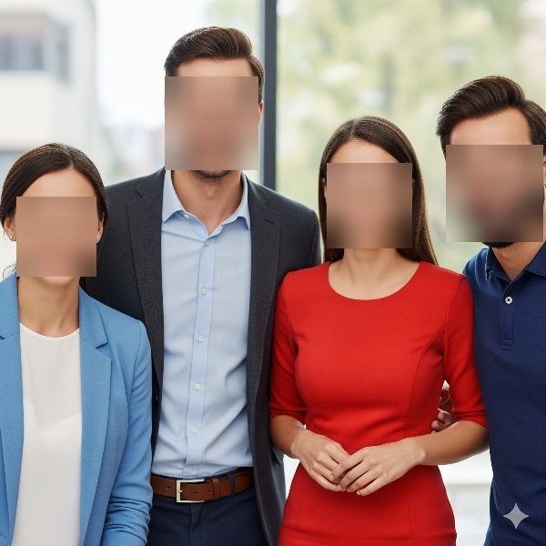

# Face Anonymizer

A Python application that automatically detects and anonymizes faces in images, videos, and webcam streams using MediaPipe and OpenCV.

## Features

- **Image Processing**: Anonymize faces in static images
- **Video Processing**: Process video files and save anonymized output
- **Real-time Webcam**: Live face anonymization from webcam feed
- **Gaussian Blur**: Uses Gaussian blur to anonymize detected faces
- **High Accuracy**: Powered by MediaPipe's BlazeFace model

## Requirements

- Python 3.9+
- OpenCV
- MediaPipe
- NumPy

## Installation

1. Clone this repository:
```bash
git clone https://github.com/nhatlong28/face_anonymizer.git
cd face_anonymizer
```

2. Install required packages:
```bash
pip install -r requirements.txt
```

## Usage

### Image Processing (Default)
```bash
python main.py --mode image --file_path ./data/human_face.jpg
```

### Video Processing
```bash
python main.py --mode video --file_path ./data/human_present.mp4
```

### Webcam (Real-time)
```bash
python main.py --mode webcam
```

## Command Line Arguments

- `--mode`: Processing mode (`image`, `video`, or `webcam`)
- `--file_path`: Path to input image or video file

## Results

### Before and After Processing

#### Original Image


#### Anonymized Result


The application successfully detects faces and applies Gaussian blur to anonymize them while preserving the rest of the image quality.

## How It Works

1. **Face Detection**: Uses MediaPipe's BlazeFace model (`blaze_face_short_range.tflite`) to detect faces in images
2. **Bounding Box Extraction**: Extracts the coordinates of detected face regions
3. **Gaussian Blur**: Applies a 51x51 Gaussian blur with sigma=20 to the face regions
4. **Image Reconstruction**: Replaces the original face regions with the blurred versions

## Project Structure

```
face_anonymizer/
├── main.py                           # Main application script
├── blaze_face_short_range.tflite    # MediaPipe face detection model
├── data/                            # Input images and videos
│   ├── human_face.jpg
│   └── human_present.mp4
├── output/                          # Processed output files
│   ├── output.jpg
│   └── output.mp4
└── README.md                        # This file
```

## Key Features

- **Multiple Input Modes**: Supports images, videos, and real-time webcam
- **Automatic Output Directory**: Creates output folder automatically
- **High Performance**: Optimized for real-time processing
- **Configurable Detection**: Minimum detection confidence of 0.5 for reliable results

## Technical Details

- **Face Detection Model**: MediaPipe BlazeFace (short range)
- **Anonymization Method**: Gaussian Blur (51x51 kernel, σ=20)
- **Video Codec**: MP4V for output videos
- **Image Format**: JPEG for output images

## License

This project is open source and available under the [MIT License](LICENSE).

## Acknowledgments

- [MediaPipe](https://ai.google.dev/edge/mediapipe/solutions/vision/face_detector/python/) for the face detection model
- [OpenCV](https://opencv.org/) for image processing capabilities
